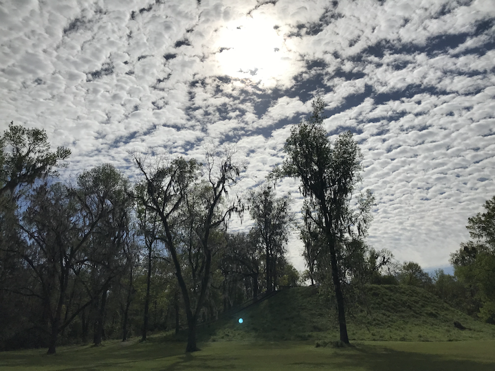

```{r setup, include=FALSE}
htmltools::tagList(rmarkdown::html_dependency_font_awesome())
```

# Welcome {.unnumbered}

```{r, out.width = "840px", echo = FALSE, fig.align = "center"}

```

---

## License {.unnumbered}

<center>

Licensed under a CC BY-NC-SA 4.0 International License by<c/enter>

<center>K. Bret Staudt Willet, Ph.D.</center>

<center>2022</center>

---

## Dedication {.unnumbered}

<center><i>For my family, E<sup>3</sup>,</i></center>

<center><i>who continually remind me of what really matters.</i></center>

---

## Acknowledgments {.unnumbered}

### Thanks {.unnumbered}

In my own journey through data analytics, I have benefited tremendously from (and wouldn't be here without) daily chats with the so-called **Koehler Diaspora** ([Josh Rosenberg](https://joshuamrosenberg.com/), [Mete Akcaoglu](https://www.meteakcaoglu.com/), [Spencer Greenhalgh](https://spencergreenhalgh.com/), and of course [Matthew Koehler](http://www.matt-koehler.com/)).

---

### I Honor Native Land



I live and work in Tallahassee, Florida, on the traditional land of the **Apalachee**, **Muscogee**, and **Miccosukee** Peoples. I completed my graduate school work while living in Lancaster County PA, on the traditional land of the **Susquehannock** People, learning from the faculty at Michigan State University in East Lansing MI, built on the traditional land of the **Peoria**, **Anishinabewaki**, **Odawa**, and **Sauk** Peoples. I was born and lived my first two decades of life in the Roanoke Valley VA, on the traditional land of the **Tutelo** People. I share these land acknowledgements to demonstrate my commitment to learning and working to dismantle the ongoing legacies of settler colonialism.

I recognize that these lands that have been important to my life remain scarred by the histories and ongoing legacies of settler colonial violence, dispossession, and removal. In spite of all of this, and with tremendous resilience, these Indigenous Nations have remained deeply connected to this territory, to their families, to their communities, and to their cultural ways of life. I recognize the ongoing relationships of care that these Indigenous Nations maintain with this land and extend my gratitude as I live and work as a humble and respectful guest upon their territory.

I encourage you to learn about and amplify the contemporary work of the Indigenous nations whose land you are on and to endeavor to support Indigenous sovereignty in all the ways that you can. To start learning, I have found the [Native Land map](https://native-land.ca/) to be fascinating to explore, and the [Honor Native Land guide](https://usdac.us/nativeland) from the U.S. Department of Arts & Culture has many useful resources. Finally, if you are in the Tallahassee area, you may find this [list of resources from the Decolonize FSU group](https://linktr.ee/decolonizefsu) to be helpful.

### Tools {.unnumbered}

This book was created with the [bookdown](https://github.com/rstudio/bookdown) package (Xie, 2021a) in [R](https://www.r-project.org/), which in turn was built on top of [R Markdown](https://rmarkdown.rstudio.com/) and [knitr](https://github.com/yihui/knitr) (Xie, 2021b).

---

## About the Author

I am an Assistant Professor of [Instructional Systems & Learning Technologies](https://education.fsu.edu/instructional-systems-and-learning-technologies) at Florida State University. My research investigates self-directed learning, especially by teachers. I'm most interested in what happens when our students, learners, and trainees finish the instruction and training we design for them. What do they do after they walk out the door or log off? How do they continue to develop the knowledge, skills, and abilities they need? Where do they look for resources? Who do they talk to?

---

## Contact {.unnumbered}

Correspondence concerning this book should be addressed to Dr. Bret Staudt Willet, Department of Educational Psychology & Learning Systems, Florida State University, 1114 W. Call St., Stone Building #3210, Tallahassee, FL 32306.

<i class="fa fa-envelope"></i> E-mail: [bret.staudtwillet\@fsu.edu](mailto:bret.staudtwillet@fsu.edu){.email}
